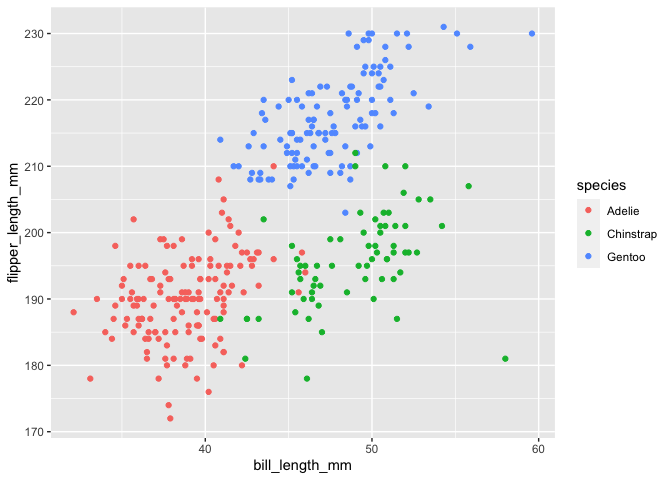

HW 1
================
Jiawen Zhao

``` r
# install.packages("palmerpenguins")
library("ggplot2")
data("penguins", package = "palmerpenguins")
nrow(penguins)
```

    ## [1] 344

``` r
ncol(penguins)
```

    ## [1] 8

``` r
penguins.filltered <- na.omit(penguins)
mean(penguins.filltered$flipper_length_mm)
```

    ## [1] 200.967

``` r
nrow(penguins.filltered)
```

    ## [1] 333

``` r
ncol(penguins.filltered)
```

    ## [1] 8

``` r
ggplot(penguins.filltered,aes(x = bill_length_mm, y=flipper_length_mm, color=species))+geom_point()
```

<!-- -->

``` r
#b = ggplot(penguins,aes(x = x, y=y, color=penguins$species))+geom_point()
ggsave("p8105_hw1_jz3570_plot.png")
```

##### In the data “palmerpenguins”, there are 8 variables (columns) and 344 observations (rows). The eight variables are island, species, bill length (mm), bill width (mm), flipper length (mm), bosy mass (g), age, and sex. There is one row of NA data. After eliminating that NA row, we have 343 rows in the dataframe, called “penguins.filltered”. The mean of flipper length is 200.967 mm.

### Problem 2

``` r
library("tidyverse")
sample = rnorm(10)
cha = c("apple", "banana", "cherry", "grape", "peach", "apple", "banana", "cherry", "grape", "peach")
fact = factor(c("low", "median", "high", "low", "median", "high", "low", "median", "high", "low"))

dataframe = 
  tibble(
    sample_norm = sample,
    boolean = sample>0,
    characters = cha,
    factors = fact
  )

## Try first way

mean(dataframe %>% pull(sample_norm))
```

    ## [1] 0.02180788

``` r
mean(dataframe %>% pull(boolean))
```

    ## [1] 0.7

``` r
mean(dataframe %>% pull(characters))
```

    ## [1] NA

``` r
mean(as.numeric(dataframe %>% pull(factors)))
```

    ## [1] 2

``` r
## Try second way

mean(dataframe$sample_norm)
```

    ## [1] 0.02180788

``` r
mean(dataframe$boolean)
```

    ## [1] 0.7

``` r
mean(dataframe$characters)
```

    ## [1] NA

``` r
mean(dataframe$factors)
```

    ## [1] NA

``` r
as.numeric(dataframe$sample_norm)
```

    ##  [1] -1.9153744  0.8769855  0.6913288  0.4311393 -0.9739456 -1.3969336
    ##  [7]  1.1274794  0.3003761  0.4957158  0.5813074

``` r
as.numeric(dataframe$boolean)
```

    ##  [1] 0 1 1 1 0 0 1 1 1 1

``` r
as.numeric(dataframe$characters)
```

    ##  [1] NA NA NA NA NA NA NA NA NA NA

``` r
as.numeric(dataframe$factors)
```

    ##  [1] 2 3 1 2 3 1 2 3 1 2

##### The first two variables, sample and logic vector, worked, but the charactor and factor vectors did not work and gave NA result. By using as.numeric function, the first variable, sample, gives the same numbers as we generated before. Spesifically, for the second variable, in the logic vector, “True”s are replaced with 1 and “False”s are replaced with 0. The charactors still give NAs as the output. However, the factor vectors are now converted to numbers. Spesifically, the three levels of this factor variables are converted to numbers, 1, 2, 3. That explains the previous part, where the first two vectors are read as numbers by R, and characters cannot be converted to numbers. Without manully convert factors to numbers, R will not process factors as numbers, but we can manully make the factors as numebrs.
